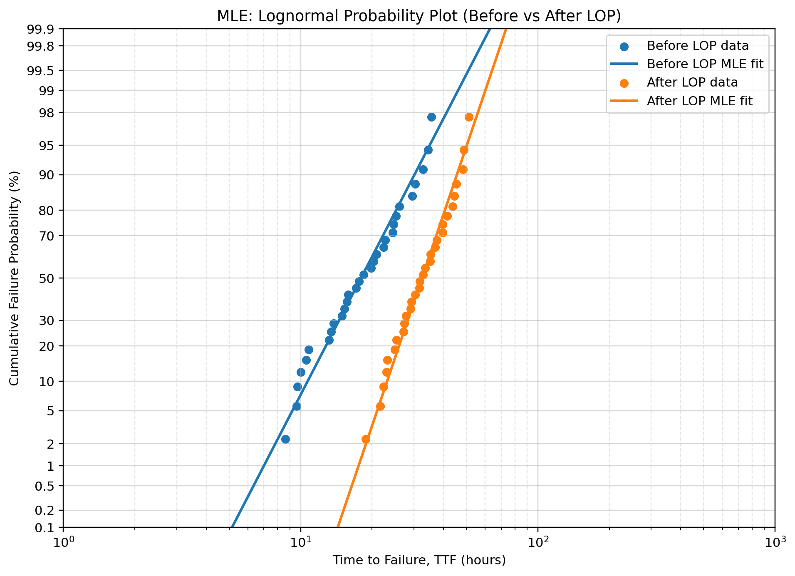
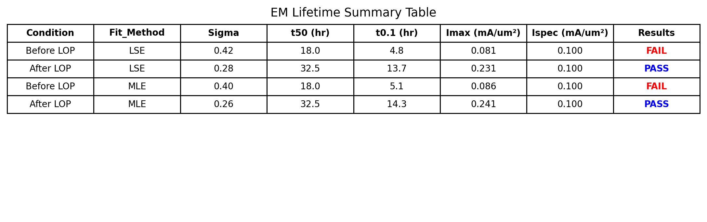

# EM Lifetime Analysis (LSE vs MLE)

This project demonstrates electromigration (EM) lifetime modeling using lognormal distribution fitting and Black’s equation.

The workflow starts from raw lifetime data and produces probability plots, lifetime metrics, and a clear pass/fail decision based on reliability targets.

---

## Overview

* Stress condition: 300°C, 0.2 mA/µm²
* Use condition: 110°C, 0.1 mA/µm²
* Target lifetime: 100,000 hours
* Failure criterion: 0.1% cumulative failure (t0.1)

Two fitting approaches are compared:

* Least Squares Estimation (LSE)
* Maximum Likelihood Estimation (MLE)

---

## What this project shows

* Lognormal probability plotting (engineering format)
* Extraction of t50 (median life) and t0.1 (early failure)
* Comparison between LSE and MLE fitting
* Reliability projection using Black’s equation
* Automated workflow: CSV → analysis → plots → summary table

---

## How to run

Install dependencies:

pip install -r requirements.txt

Run the analysis:

python EM_lifetime.py

Outputs will be generated in the `outputs/` folder.

---

## Example Output

### LSE Probability Plot

### MLE Probability Plot

### Summary Table

---

## Notes

* t50 (median life) is nearly identical for LSE and MLE
* Differences in sigma affect t0.1 significantly
* Reliability decisions (pass/fail) are driven by t0.1 rather than t50

---

## Why this matters

This reflects how EM reliability is evaluated in practice:

* fitting lifetime distributions
* focusing on early failure behavior
* translating results into design limits (Imax vs spec)

The goal is not just curve fitting, but making a clear engineering decision from data.
